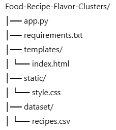
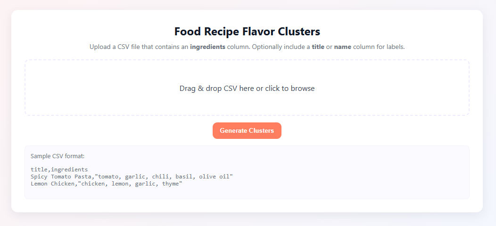
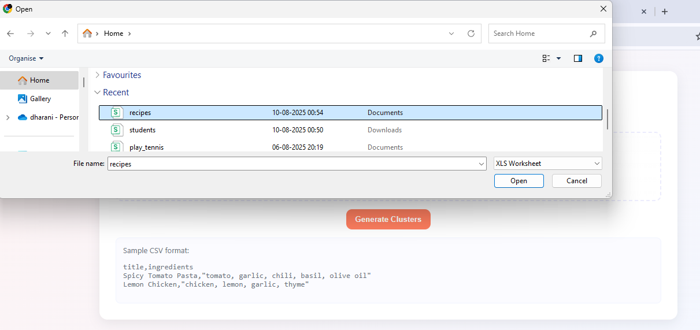
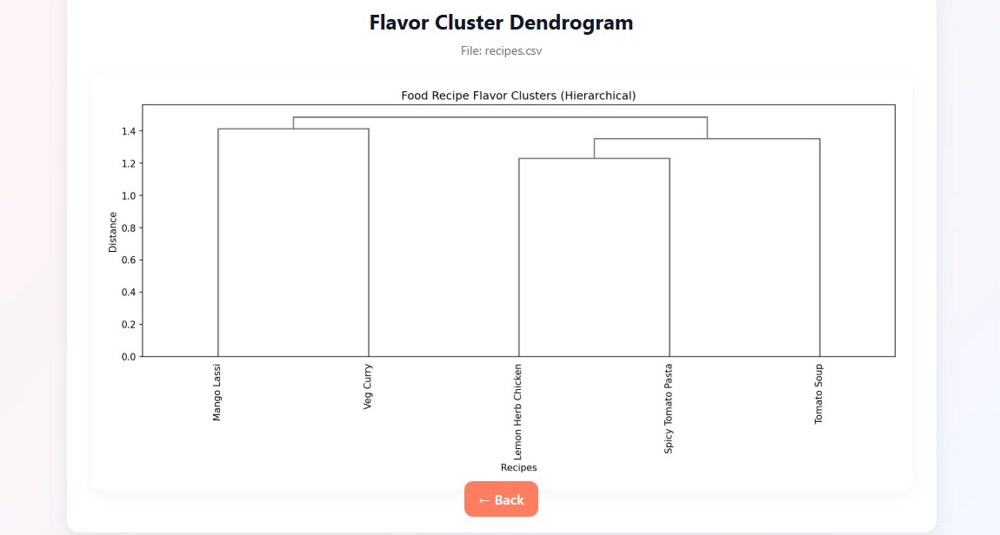

# Food Recipe Flavor Clusters

##  Overview
This project uses **Hierarchical Clustering** to group recipes into "flavor families" based on ingredient similarity.  
The app allows users to upload a CSV file of recipes and view an interactive dendrogram of recipe clusters.

---

##  Features
- Upload recipe datasets in CSV format.
- Cluster recipes using **Hierarchical Clustering**.
- Generate dendrograms for visualizing flavor families.
- Simple and attractive web interface (Flask + HTML/CSS).

---

##  Tech Stack
- **Python 3.x**
- **Flask**
- **Pandas**
- **Scikit-learn**
- **Matplotlib**
- **Bootstrap / Custom CSS**

---

##  Project Structure
# Food Recipe Flavor Clusters

##  Overview
This project uses **Hierarchical Clustering** to group recipes into "flavor families" based on ingredient similarity.  
The app allows users to upload a CSV file of recipes and view an interactive dendrogram of recipe clusters.

---

##  Features
- Upload recipe datasets in CSV format.
- Cluster recipes using **Hierarchical Clustering**.
- Generate dendrograms for visualizing flavor families.
- Simple and attractive web interface (Flask + HTML/CSS).

---

##  Tech Stack
- **Python 3.x**
- **Flask**
- **Pandas**
- **Scikit-learn**
- **Matplotlib**
- **Bootstrap / Custom CSS**

---

##  Project Structure

---

##  Example Dataset

title,ingredients
Spicy Tomato Pasta,"tomato, garlic, chili flakes, basil, olive oil"
Lemon Herb Chicken,"chicken, lemon, garlic, thyme, olive oil"
Veg Curry,"potato, peas, turmeric, cumin, coriander, chili"
Mango Lassi,"mango, yogurt, sugar, cardamom"
Tomato Soup,"tomato, onion, garlic, basil, cream"

## Installation & Setup

1. Clone the repository

   git clone https://github.com/yourusername/Food-Recipe-Flavor-Clusters.git
   cd Food-Recipe-Flavor-Clusters

2. Create a virtual environment

   python -m venv venv

3. Activate the environment

    Windows:
    venv\Scripts\activate

    Mac/Linux:
    source venv/bin/activate
4. Install dependencies

    pip install -r requirements.txt

5. Run the Flask app

     python app.py

6.  Open in browser

     http://127.0.0.1:5000/
 ---

## INPUT
   
    

## Add file

    

## Output

    

## Author

      R.DHARANI SRI

## Acknowledgments

  Inspired by the idea of exploring recipes through data science.

  Built with Flask and Python for educational purposes.

